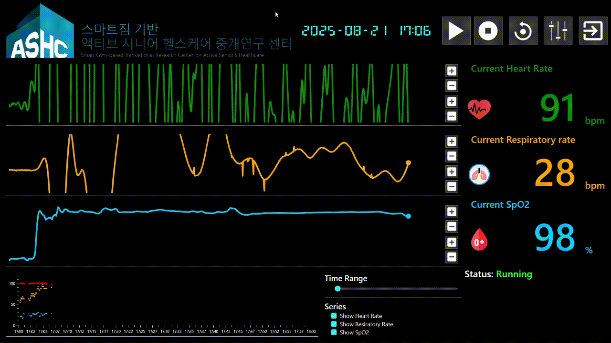

# Smart Chair Monitoring

## Introduction

**Smart Chair** is an intelligent health monitoring solution designed to track a user’s heart rate and respiration rate using fusion sensor technology. The system integrates multiple sensors embedded in the chair to capture physiological signals non-invasively while the user is sitting.

## Key Features

- Fusion sensor technology for accurate heart rate and respiration rate measurement.
- Hardware development for integrating and optimizing multi-sensor data acquisition.
- Software development for signal processing, data analysis, and visualization.
- Real-time monitoring of heart rate and respiration rate to detect abnormal patterns early.

## Demo

## Contact

- **Author:** Quy Phuong Le
- **Email:** lequyphuong1903@gmail.com

---

_Thank you for your interest in this project!_
